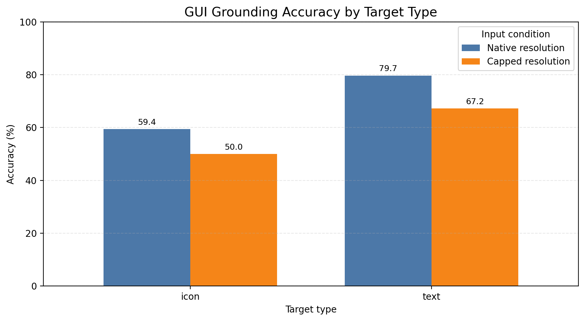
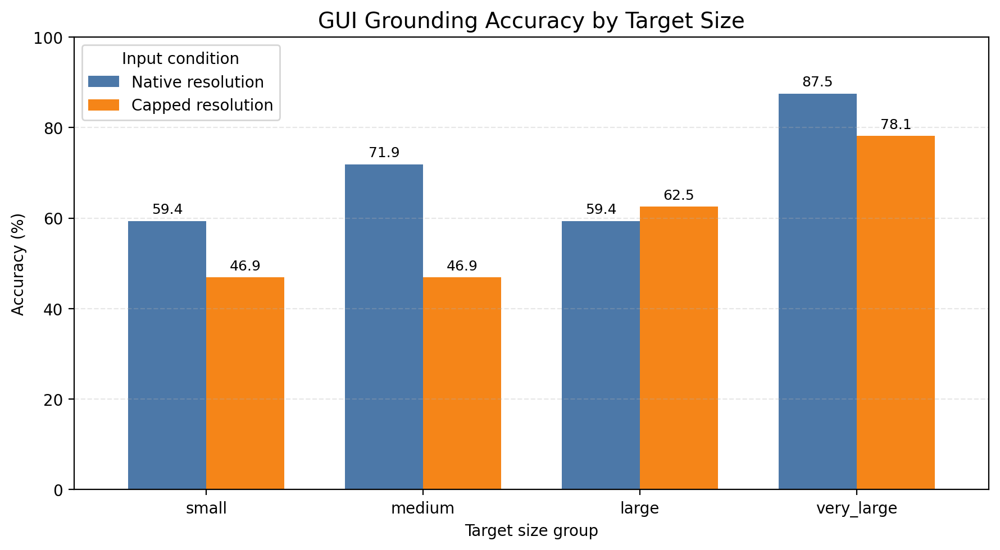

# Reliable Visual Agents

Benchmarking GUI grounding, inference failures, and eventually action
verification and recovery.

This undergraduate research project asks how visual input constraints affect
both the accuracy and execution reliability of a vision-language model (VLM),
then extends the evaluation into a controlled visual-agent environment.

## Research question

> How does resolution capping change GUI-grounding accuracy and inference
> reliability, and which target categories are most affected?

## Part A — ScreenSpot grounding

Each benchmark example contains a GUI screenshot, a natural-language
instruction, and a target bounding box. Qwen2.5-VL-3B-Instruct predicts one
click coordinate. A prediction is correct when the point falls inside the
ground-truth box.

The first experiment uses one fixed stratified sample of 128 ScreenSpot
examples: 64 icon targets and 64 text targets, balanced across four target-area
quartiles. The same examples are evaluated under native and capped input
resolution.

### Initial results

| Input condition | Correct | Wrong location | No valid action | Inference error | Accuracy | Valid action rate |
| --- | ---: | ---: | ---: | ---: | ---: | ---: |
| Native resolution | 89 | 30 | 8 | 1 | **69.53%** | 92.97% |
| Capped resolution | 75 | 44 | 9 | 0 | **58.59%** | 92.97% |

Resolution capping removed the single native-resolution inference error (a GPU
out-of-memory failure), but reduced grounding accuracy by 10.94 percentage
points. Coordinate predictions from resized images were mapped back to the
correct coordinate system before evaluation; this correction was performed
offline without rerunning model inference.



Text targets remained easier than icon targets in both conditions. The
observed reduction was 12.50 percentage points for text and 9.38 points for
icons.



The size effect was not monotonic. Medium targets showed the largest observed
decline (25.00 percentage points), while large targets improved by 3.12 points.
Because each size group contains only 32 examples, these are preliminary
descriptive results rather than claims of statistical significance.

### Reproduce the evaluation components

Inspect one ScreenSpot sample:

```powershell
.\.venv\Scripts\python.exe src\dataset.py
```

Run the evaluator sanity check:

```powershell
.\.venv\Scripts\python.exe src\run_sanity_check.py
```

The model inference notebook is
[`experiments/screenspot_qwen_baseline.ipynb`](experiments/screenspot_qwen_baseline.ipynb).
It is intended for a GPU-backed Google Colab runtime. The frozen sample
manifest and per-example predictions are stored in [`results/`](results/).

Regenerate the result figures:

```powershell
.\.venv\Scripts\python.exe src\plot_results.py
```

## Part B — Controlled agent reliability

The repository also contains a deterministic six-card browser environment.
It supports screenshots, real clicks, selection-state changes, submission, and
automated scoring. Its executor can deterministically drop the first valid card
click while keeping the fault flag hidden from the Agent. Scripted checks verify
that the dropped click leaves page state unchanged and that a repeated click can
recover. The next study will compare reactive behavior, explicit verification,
and bounded retry under this controlled failure.

Start the environment:

```powershell
.\.venv\Scripts\python.exe run_environment.py
```

Run the scripted action/scoring check:

```powershell
.\.venv\Scripts\python.exe run_scripted.py
```

## Repository structure

```text
environment/   Controlled browser task for Part B
experiments/   Colab VLM inference notebook
results/       Frozen manifest, predictions, tables, and figures
src/           Dataset inspection, evaluation, sanity checks, and plotting
docs/          Research scope and checkpoints
```

## Limitations

- One VLM and one prompt configuration.
- A 128-example stratified pilot, not the full benchmark.
- Descriptive subgroup comparisons without confidence intervals yet.
- Capped-resolution results depend on correct preprocessing-coordinate mapping.
- Part B failure detection and recovery experiments are not complete.

See the [research plan](docs/research_plan.md) for the current checkpoints and
scope boundary.
