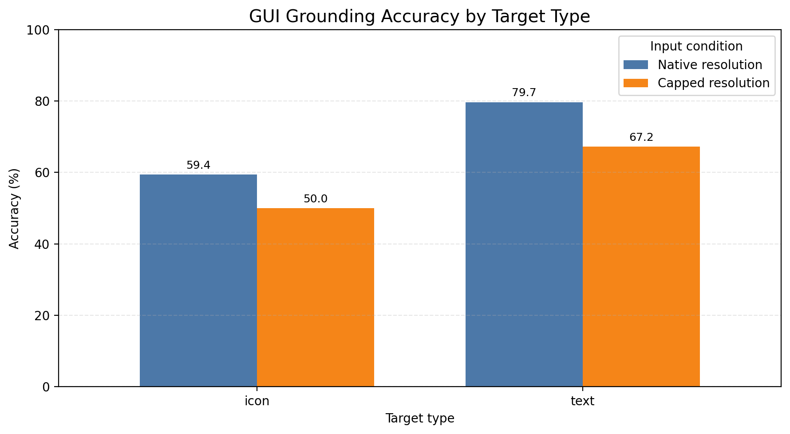
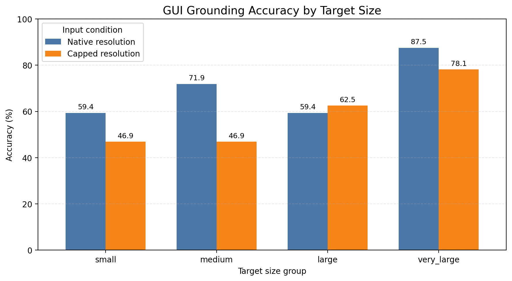
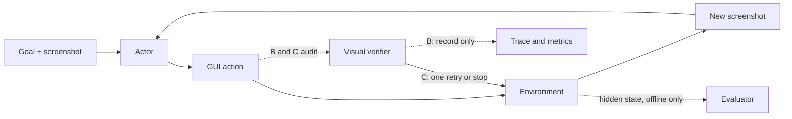

# Reliable Visual Agents

Benchmarking GUI grounding, failure detection, and bounded recovery.

This undergraduate research project studies where vision-language-model (VLM)
agents fail during GUI interaction and whether explicit post-action
verification and bounded recovery improve reliability. It combines an external
GUI-grounding benchmark with a controlled browser environment in which task
state, termination, injected faults, and recovery cost can be measured
separately.

## Research questions

> **Grounding:** How does input-resolution capping change GUI-grounding
> accuracy and inference reliability, and which target categories are most
> affected?
>
> **Agent reliability:** Why do visual agents fail during multi-step GUI
> interaction, and when do post-action verification and bounded recovery help
> rather than introduce new failures?

## Current findings

- On a fixed 128-example ScreenSpot subset, input-resolution capping reduced
  GUI-grounding accuracy by 10.94 percentage points while avoiding the single
  native-resolution GPU OOM observed in this sample.
- Controlled agent traces show that correct GUI state and correct termination
  are distinct reliability problems: an Agent can complete the requested state
  change but fail to recognize completion.
- In the saved 51-episode Part B pilot, the shadow-verification arm matched the
  no-verification baseline's outcomes while adding about 18 seconds of verifier
  latency per episode. This validates the intended policy isolation and
  measures verification cost.
- The same verifier was unsafe as a controller in this pilot. Of its 36
  `complete` predictions in shadow mode, 27 (75%) were false against hidden
  evaluator state. Allowing those signals to stop or retry the Agent reduced
  task-state success from 4/17 for A and B to 0/17 for C; 10/17 C episodes
  terminated on false completion.

These are diagnostic pilot results from one 3B VLM and 51 of 72 planned
episodes. They support a concrete failure mechanism, not a general claim that
verification is harmful. The remaining research question is how to calibrate
or ground verification before granting it control over policy.

## Part A — ScreenSpot grounding

Each benchmark example contains a GUI screenshot, a natural-language
instruction, and a target bounding box. Qwen2.5-VL-3B-Instruct predicts one
click coordinate. A prediction is correct when the point falls inside the
ground-truth box.

The first experiment uses one fixed stratified sample of 128 ScreenSpot
examples: 64 icon targets and 64 text targets, balanced across four target-area
quartiles. The same examples are evaluated under native and capped input
resolution.

### Initial results

| Input condition | Correct | Wrong location | No valid action | Inference error | Accuracy | Valid action rate |
| --- | ---: | ---: | ---: | ---: | ---: | ---: |
| Native resolution | 89 | 30 | 8 | 1 | **69.53%** | 92.97% |
| Capped resolution | 75 | 44 | 9 | 0 | **58.59%** | 92.97% |

Resolution capping avoided the single native-resolution GPU OOM observed in
this sample, but reduced grounding accuracy by 10.94 percentage points. Coordinate predictions from resized images were mapped back to the
correct coordinate system before evaluation; this correction was performed
offline without rerunning model inference.



Text targets remained easier than icon targets in both conditions. The
observed reduction was 12.50 percentage points for text and 9.38 points for
icons.



The size effect was not monotonic. Medium targets showed the largest observed
decline (25.00 percentage points), while large targets improved by 3.12 points.
Because each size group contains only 32 examples, these are preliminary
descriptive results rather than claims of statistical significance.

### Reproduce the evaluation components

Inspect one ScreenSpot sample:

```powershell
.\.venv\Scripts\python.exe src\dataset.py
```

Run the evaluator sanity check:

```powershell
.\.venv\Scripts\python.exe src\run_sanity_check.py
```

The model inference notebook is
[`experiments/screenspot_qwen_baseline.ipynb`](experiments/screenspot_qwen_baseline.ipynb).
It is intended for a GPU-backed Google Colab runtime. The frozen sample
manifest and per-example predictions are stored in [`results/`](results/).

Regenerate the result figures:

```powershell
.\.venv\Scripts\python.exe src\plot_results.py
```

## Part B — Controlled agent reliability

The primary Part B environment is a realistic, click-only Settings App with
Appearance, Notifications, and Privacy task families. Each task requires four
visible interactions: navigate to a section, change one setting, save, and
confirm. Hidden evaluator state checks the saved value and is never provided to
the Agent.

The original six-card environment remains as a small regression test. Both
environments now support deterministic dropped-click faults with evaluator-only
audit state. The Settings App drops the first click that would change a setting
while leaving navigation and submission actions unaffected. Scripted checks
compare no retry against one repeated setting click; they validate the fault
mechanism, not autonomous Agent recovery.

### Clean controlled ablation

All strategies use the same Qwen2.5-VL-3B-Instruct model, click-only action
space, task distribution, and eight-action budget. Retries count as actions;
Verifier calls and latency are reported rather than treated as free.

| Arm | Added mechanism | Purpose |
| --- | --- | --- |
| **A — No verification** | Screenshot-to-action Actor only | Establish the policy baseline |
| **B — Verification only** | Run the visual verifier after every action and record its output | Measure verifier quality and cost without changing Actor behavior |
| **C — Verification + recovery** | The same verifier may stop on `complete` and retry one `no_effect` action | Measure the causal effect of giving verification limited policy control |

All three clean arms are implemented by `run_settings_agent.py`. A and B use
the same Actor policy; B's verifier output stays in the trace and cannot stop,
retry, block, replan, or modify the Actor prompt. C uses the same verifier with
only two control rules: stop on `complete`, and retry the first `no_effect` at
most once. Clean B/C contain no repeat guard or forbidden-region replanning.
The older enhanced strategy remains separately available in
`run_settings_verified_agent.py` and is not pooled with clean C.

Hidden evaluator state is written only for offline audit and is never included
in an Actor or Verifier prompt. See the [clean ablation protocol](docs/clean_part_b_ablation.md)
and [agent protocol](docs/agent_protocol.md).


```mermaid
flowchart LR
    G[Goal + screenshot] --> A[Actor]
    A --> X[GUI action]
    X --> E[Environment]
    E --> O[New screenshot]
    O --> A
    X -. B and C audit .-> V[Visual verifier]
    V -. B: record only .-> L[Trace and metrics]
    V -- C: one retry or stop --> E
    E -. hidden state, offline only .-> S[Evaluator]
```

### Part B pilot results

The saved interrupted batch contains 51 of 72 planned episodes: seeds 0-8 for
the dropped-action condition and seeds 0-7 for the no-fault condition. Results
are descriptive because the batch is incomplete and uses one model and prompt.

| Fault mode | Arm | Episodes | Task-state success | Correct termination | False-completion termination | Mean verifier latency |
| --- | --- | ---: | ---: | ---: | ---: | ---: |
| Dropped first setting change | A | 9 | 22.2% | 22.2% | 0.0% | 0.0 s |
| Dropped first setting change | B | 9 | 22.2% | 22.2% | 0.0% | 18.5 s |
| Dropped first setting change | C | 9 | **0.0%** | **0.0%** | **55.6%** | 12.2 s |
| No fault | A | 8 | 25.0% | 12.5% | 0.0% | 0.0 s |
| No fault | B | 8 | 25.0% | 12.5% | 0.0% | 18.0 s |
| No fault | C | 8 | **0.0%** | **0.0%** | **62.5%** | 11.4 s |

Across both conditions, A and B each reached the correct task state in 4/17
episodes. C reached it in 0/17 and falsely terminated on verifier completion in
10/17. B recorded 36 `complete` predictions, 27 of which disagreed with hidden
task state. The key result is therefore sharper than “verification did not
help”: **an uncalibrated completion signal became a new failure channel when it
was promoted from observation to control.**

This does not establish that recovery is broadly harmful. It establishes that
this verifier did not satisfy the precision needed for a termination authority,
and that recovery evaluation must measure verifier errors against hidden state
before using them to control an Agent.

The complete interpretation, failure taxonomy, and limitations are documented
in the [Part B pilot report](docs/part_b_pilot_report.md).

Audit the saved B-arm verifier predictions offline, without loading the model
or changing any Agent action:

```bash
python summarize_completion_verifier.py \
  artifacts/settings_ablation_runs/clean_abc_v1
```

The benchmark compares every `complete` prediction with hidden evaluator state
immediately after that action. It reports completion precision, recall,
false-positive rate, a 95% Wilson interval, and a conservative control gate.
The default qualification rule requires at least ten completion predictions
and a 95% precision lower bound of at least 90% before the signal is considered
safe enough to control termination. This is a proposed safety criterion for the
next experiment, not a threshold preregistered for the existing pilot.

On the saved B-arm pilot, the offline audit evaluated 127 action-level
predictions: 9 true positives, 27 false positives, 91 true negatives, and no
false negatives. Completion recall was 100%, but precision was only 25.0%
(95% Wilson interval: 13.8%-41.1%) and the false-positive rate was 22.9%.
The conservative control gate therefore failed. The compact audit outputs are
stored in [`results/part_b_completion_verifier_pilot/`](results/part_b_completion_verifier_pilot/).

One prompt-only follow-up was evaluated on the same frozen screenshots:

```bash
python run_completion_gate_benchmark.py \
  artifacts/settings_ablation_runs/clean_abc_v1 \
  --output artifacts/completion_gate_g1.json
```

`G1_evidence_required_v1` used stricter instructions requiring visible evidence
of the target value, saved state, and no remaining action. It performed worse:

| Completion method | Precision | Recall | False-positive rate | Control gate |
| --- | ---: | ---: | ---: | --- |
| Original verifier | 25.0% | 100% | 22.9% | Fail |
| Evidence-required G1 | **13.4%** | 100% | **49.2%** | Fail |

G1 produced 9 true positives, 58 false positives, 60 true negatives, and no
false negatives. The result shows that stricter prompt wording did not
calibrate this 3B model's completion decisions. No additional recovery or
prompt variants are added. Future work should evaluate a stronger or
independently trained verifier.

To test whether this failure is specific to the original 3B model, run one
controlled cross-model comparison on the same 127 frozen screenshots. This
loads a standalone verifier and does not rerun or influence the Actor:

```bash
python run_completion_gate_benchmark.py \
  artifacts/settings_ablation_runs/clean_abc_v1 \
  --model-id Qwen/Qwen3-VL-4B-Instruct \
  --prompt-version G0_baseline_v1 \
  --output artifacts/completion_gate_qwen3_vl_4b_g0.json
```

The original `G0_baseline_v1` prompt is fixed so that the verifier model is the
only experimental variable. Compare completion precision, recall, and
false-positive rate with the original verifier audit. This is a bounded
diagnostic experiment rather than a new Agent strategy.

### Observed failure cases

| Failure | Trace evidence | Reliability implication |
| --- | --- | --- |
| **Termination failure** | The Compact setting was saved with no unapplied changes, but the Actor continued until its action budget was exhausted. | Reaching the requested GUI state does not guarantee that an Agent knows when to stop. |
| **Repeated-action loop** | After correctly turning off Sound alerts, the Actor repeatedly clicked the same switch, reversed progress, and never saved. | Grounding the correct control is insufficient without state-change and progress tracking. |
| **False-negative verification** | Hidden offline audit recorded `comfortable → compact`, while the visual Verifier classified the click as `no_effect` and triggered an unnecessary retry. | A noisy Verifier can make bounded recovery less reliable rather than more reliable. |

Start the environment:

```powershell
.\.venv\Scripts\python.exe run_environment.py
```

Run the scripted action/scoring check:

```powershell
.\.venv\Scripts\python.exe run_scripted.py
```

Run the multi-step Settings App check:

```powershell
.\.venv\Scripts\python.exe run_settings_scripted.py
```

Run one clean episode in a GPU environment after installing
`requirements-agent.txt` and Playwright Chromium:

```bash
python run_settings_agent.py --strategy A --seed 0 --fault-mode none
```

After the normal smoke test is inspected, run one dropped-click episode:

```bash
python run_settings_agent.py --strategy C --seed 1 --fault-mode drop_first_setting_change
```

Run the older enhanced visual-verification strategy separately:

```bash
python run_settings_verified_agent.py --seed 0 --fault-mode none
```

The enhanced strategy combines semantic verification with deterministic
screenshot-difference detection, one retry, a completion gate, and additional
replanning guards. Its results must not be labeled as clean C.

### Goal-progress benchmark — ongoing

Pixel difference can establish that the screen changed, but not whether the
change was progress, regression, or irrelevant. A separate Goal-Progress
Verifier therefore predicts one of `progress`, `regression`, `irrelevant`,
`no_effect`, `complete`, or `uncertain` from the goal, requested click, and
before/after screenshots.

Generate the balanced 15-transition Settings pilot and evaluate the frozen
`P0_zero_shot_v1` prompt without letting it control the Agent:

```bash
python generate_progress_transition_dataset.py
python run_progress_transition_benchmark.py
```

The controlled pilot contains three task families and three examples per
reference label (`progress`, `regression`, `irrelevant`, `no_effect`, and
`complete`). The runner reports overall and per-class metrics and saves the
complete predictions plus CSV/PNG confusion matrices. Hidden Settings state is
isolated in the dataset's audit manifest and is never included in model input.
The dataset and evaluator are complete; valid GPU inference and analysis are
ongoing, so no Goal-Progress accuracy is reported yet.

See the [Settings App task specification](docs/settings_task_spec.md) for the
observation, action, success, and hidden-information contract.

## Repository structure

```text
environment/   Simple regression task and realistic Settings App for Part B
experiments/   Colab VLM inference notebook
results/       Frozen manifest, predictions, tables, and figures
src/           Dataset inspection, evaluation, sanity checks, and plotting
tests/         Unit tests for protocols, policies, metrics, and evaluators
docs/          Research scope and checkpoints
```

## Limitations

- One VLM and one prompt configuration.
- A 128-example stratified pilot, not the full benchmark.
- Descriptive subgroup comparisons without confidence intervals yet.
- Capped-resolution results depend on correct preprocessing-coordinate mapping.
- The Part B batch is an interrupted 51/72-episode pilot, not a completed
  held-out statistical evaluation.
- Part B uses Qwen2.5-VL-3B-Instruct for both Actor and Verifier, so their
  errors may be correlated.
- The 15-transition Goal-Progress set is a small Settings-specific pilot and
  does not establish cross-application generalization.
- The full preregistered A/B/C batch and valid Goal-Progress GPU benchmark
  remain ongoing.

See the [research plan](docs/research_plan.md) for the current checkpoints and
scope boundary.
